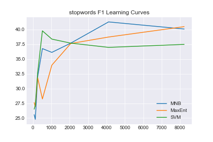

# Informe Práctico 3
## Procesamiento del Lenguaje Natural, Verano 2018
Alumno : Juan Manuel Pérez

## 1. Corpus de entrenamiento

Para la tarea, utilizamos el corpus TASS que consta de tweets etiquetados con 4 posibles sentimientos:

- P: Positivo
- N: Negativo
- NEU: Neutro
- NONE: Ninguno


### Estadísticas General TASS
| Polaridad      |   Cantidad      |    Frecuencia   |
|:---------------|:----------------|:----------------|
| P              | 2884            | 0.400           |
| N              | 2182            | 0.302           |
| NEU            | 670             | 0.092           |
| NONE           | 1483            | 0.206           |


### Estadísticas InterTASS
| Polaridad      |   Cantidad      |    Frecuencia   |
|:---------------|:----------------|:----------------|
| P              | 318             | 0.3155          |
| N              | 418             | 0.4146          |
| NEU            | 133             | 0.1319          |
| NONE           | 139             | 0.1378          |

## Clasificadores utilizados

Utilizamos un modelo Bag of Words (BoW) de los tweets mediante la utilización de `CountVectorizer` de `sklearn`. A su vez, utilizamos 3 algoritmos de clasificación:

- Logistic Regression (maxent)
- Multinomial Näive Bayes (mnb)
- Linear Support Vector Machines (svm)

A su vez, para la extracción de features utilizamos varias técnicas:

- **base**: `CountVectorizer`, BoW sin ningún preprocesamiento
- **tw_tknzr**: Mejor tokenizador (`TweetTokenizer` de `nltk`)
- **tw_tknzr+norm**: Lo mismo que el anterior, pero removemos hashtags, pasamos todo a minúsculas, y sacamos handles (`@user`)
- **binary**: `CountVectorizer` con modo binario, no cuenta ocurrencias sino sólo aparición
- **stopwords**: Remuevo stopwords en español (sacadas de `nltk.corpus`)

A continuación, vemos los resultados de estos tests sobre un conjunto de validación cruzada.


|                      |   accuracy |   macro-f1  |   macro-precision  |   macro-recall   |
|:---------------------|-----------:|------------:|------------------: |---------------:  |
| base_MNB             |    53.7549 |    40.3214  |           43.6245  |        37.4832   |
| base_MaxEnt          |    52.5692 |    39.8696  |           39.3968  |        40.3537   |
| base_SVM             |    50.3953 |    40.0222  |           39.1572  |        40.9263   |
| tw_tknzr_MNB         |**55.1383** | **44.2922** |         **52.454** |        38.3284   |
| tw_tknzr_MaxEnt      |    51.3834 |    40.9117  |           41.4502  |        40.3869   |
| tw_tknzr_SVM         |    49.4071 |    39.4505  |           38.7504  |        40.1764   |
| tw_tknzr+norm_MNB    |    54.3478 |    40.6992  |           43.9208  |        37.9179   |
| tw_tknzr+norm_MaxEnt |    50.9881 |    40.8182  |           41.1478  |      **40.4938** |
| tw_tknzr+norm_SVM    |    48.0237 |    37.8692  |           37.1682  |        38.5971   |
| binary_MNB           |    53.3597 |    38.1057  |           39.3182  |        36.9658   |
| binary_MaxEnt        |    51.1858 |    38.3458  |           37.4729  |        39.2604   |
| binary_SVM           |    50.3953 |    40.2985  |           39.5557  |        41.0698   |
| stopwords_MNB        |    49.6047 |    40.0845  |           44.3956  |        36.5365   |
| stopwords_MaxEnt     |    50.9881 |    40.4897  |           40.7077  |        40.2741   |
| stopwords_SVM        |    46.4427 |    37.4804  |           36.8969  |        38.0828   |

Podemos observar que, observando **f1** y **accuracy** el mejor clasificador es el Näive Bayes utilizando como features sólo el tokenizado especial para tweets de `nltk`.

## Curvas de aprendizaje

En todas las curvas, podemos observar un patrón similar: mientras el F1 suele aumentar o estancarse levemente, el accuracy tiende a tener un pico con pocos datos, y luego bajar. Este fenómeno puede deberse a que el clasificador, con pocos datos, tiende a utilizar la clase mayoritaria (P) lo cual minimiza la tasa de error pero con baja precision y recall para cada una de las clases

### Base


### Tweet Tokenizer


### Tweet Tokenizer + Normalization


### Binary


### stopwords




## Features más relevantes

Para observar los features más relevantes, utilizamos un clasificador de regresión logística y los features extraídos por el *TweetTokenizer*.

Los resultados obtenidos fueron:

```
N:
	portada ;-) enhorabuena besos buena ([-1.79455119 -1.79385749 -1.32522904 -1.32330086 -1.31996872])
	denuncia odio recortes muertos triste ([1.61085566 1.67503365 1.73063649 2.00134694 2.35689936])
NEU:
	parados cree portada toda cont ([-1.07308983 -1.04328449 -0.99198165 -0.98635968 -0.94534415])
	expectación decidirán huelga @palomacervilla broma ([1.26534759 1.29802823 1.32196835 1.32926172 1.40175607])
NONE:
	;-) feliz gracias gran mal ([-2.3014078  -1.89779197 -1.78641882 -1.74520424 -1.61971695])
	periódico jugar @juandevi reunión portada ([1.25258114 1.33123844 1.35833665 1.45095676 2.25098602])
P:
	culpa triste portada urdangarin odio ([-1.46644099 -1.41013482 -1.37790014 -1.28119956 -1.20576253])
	felicidades gracias homenaje enhorabuena ;-) ([1.90229751 1.9487667  2.04844774 2.31960857 2.37838754])
```

Podemos observar que hay un problema con esta extracción de features: utiliza handles (`@juandevi, @palomacervilla`) como una feature relevante en NONE. Claramente, esto significa que está generalizando erróneamente.

Por otro lado, tienen sentido las palabras con pesos positivs y negativos tanto para P y N. Para NEU y NONE, estas palabras son un poco menos claras.

### Ejemplo de Tweet

```
@Sakura_Abril Ow
Bueno, no pasa nada, cuando puedas confirmarlo, estoy aquí 😊
Y si no pudieras de cosplay pero sí a la expo, +
```
Veamos los pesos que reportan. Como vemos, "bueno" a secas suma mucho para P, así como el emoji feliz.

```
+ [ 0.21166957  0.02943818 -0.1805304  -0.16154715]
, [-0.08546664 -0.0203392  -0.06837049  0.08972665]
@sakura_abril [-0.17543811 -0.22603359 -0.0067455   0.41811734]
a [-0.02856551  0.10424848 -0.14330023  0.01322859]
aquí [-0.35901045 -0.02002835  0.04100514  0.18960446]
bueno [-0.76706165 -0.02381811 -0.29472122  0.93705745]
confirmarlo [-0.17543811 -0.22603359 -0.0067455   0.41811734]
cosplay [-0.02941664 -0.23643822 -0.08919284  0.35250999]
cuando [ 0.70450087 -0.07313396 -0.24487917 -0.5872877 ]
de [ 0.13807588 -0.07258769 -0.20564828 -0.03271813]
estoy [ 0.12341334  0.62364231 -0.79786906  0.08153221]
expo [ 0.11096973 -0.32431564 -0.30251508  0.53112599]
la [ 0.1725178   0.03800616 -0.36194174  0.02483806]
nada [-0.29786422  0.36198971 -0.53273244  0.29814501]
no [ 0.79010499  0.11231838 -0.5113652  -0.70129678]
ow [-0.17543811 -0.22603359 -0.0067455   0.41811734]
pasa [-0.18640421  0.65190294 -0.15817745 -0.03822046]
pero [ 3.71790958e-04  9.71877709e-01 -6.41471121e-01 -4.54635502e-01]
pudieras [ 0.05549941 -0.37494453 -0.00707205  0.08682954]
puedas [-0.31076982 -0.03434519  0.12895135  0.27770601]
si [-0.07618001  0.62368716  0.05859711 -0.39541633]
sí [ 9.85926424e-05  5.92319874e-01  1.55913444e-02 -3.42777552e-01]
y [ 0.04956735 -0.17641103 -0.28179037  0.12943351]
😊 [-0.17543811 -0.22603359 -0.0067455   0.41811734]
```

## Resultados sobre test

Analizando tw_tknzr_MNB sobre el conjunto de test obtenemos:

```
Sentiment P:
  Precision: 52.09% (524/1006)
  Recall: 81.62% (524/642)
  F1: 63.59%
Sentiment N:
  Precision: 60.05% (529/881)
  Recall: 68.97% (529/767)
  F1: 64.20%
Sentiment NEU:
  Precision: 0.00% (0/4)
  Recall: 0.00% (0/216)
  F1: 0.00%
Sentiment NONE:
  Precision: 50.00% (4/8)
  Recall: 1.46% (4/274)
  F1: 2.84%
Accuracy: 55.66% (1057/1899)
Macro-Precision: 40.53%
Macro-Recall: 38.01%
Macro-F1: 39.23%
	P	N	NEU	NONE
P	524	113	2	3
N	237	529	1	0
NEU	106	109	0	1
NONE	139	130	1	4
```

En primer lugar, podemos observar que el clasificador tiene una performance (en accuracy y precision también) sensiblemente mejor que el algoritmo de clase mayoritaria, alrededor del 40%. Con lo cual, efectivamente está aprendiendo de los datos.

Podemos observar que la mejor performance del clasificador es sobre las clases *P* y *N*, y principalmente para la clase *NEU* es particularmente malo. Esto puede ser producto de ser una clase con esencialmente mucho ruido, y desbalanceada respecto de las primeras dos.

Como trabajo a futuro, queda mejorar la ingeniería de features y utilizar otros algoritmos de clasificación para mejorar su performance
