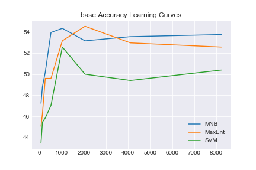

# Informe Práctico 3
## Procesamiento del Lenguaje Natural, Verano 2018
Alumno : Juan Manuel Pérez

## 1. Corpus de entrenamiento

Para la tarea, utilizamos el corpus TASS que consta de tweets etiquetados con 4 posibles sentimientos:

- P: Positivo
- N: Negativo
- NEU: Neutro
- NONE: Ninguno


### Estadísticas General TASS
| Polaridad      |   Cantidad      |    Frecuencia   |
|:---------------|:----------------|:----------------|
| P              | 2884            | 0.400           |
| N              | 2182            | 0.302           |
| NEU            | 670             | 0.092           |
| NONE           | 1483            | 0.206           |


### Estadísticas InterTASS
| Polaridad      |   Cantidad      |    Frecuencia   |
|:---------------|:----------------|:----------------|
| P              | 318             | 0.3155          |
| N              | 418             | 0.4146          |
| NEU            | 133             | 0.1319          |
| NONE           | 139             | 0.1378          |

## Clasificadores utilizados

Utilizamos un modelo Bag of Words (BoW) de los tweets mediante la utilización de `CountVectorizer` de `sklearn`. A su vez, utilizamos 3 algoritmos de clasificación:

- Logistic Regression (maxent)
- Multinomial Näive Bayes (mnb)
- Linear Support Vector Machines (svm)

A su vez, para la extracción de features utilizamos varias técnicas:

- **base**: `CountVectorizer`, BoW sin ningún preprocesamiento
- **tw_tknzr**: Mejor tokenizador (`TweetTokenizer` de `nltk`)
- **tw_tknzr+norm**: Lo mismo que el anterior, pero removemos hashtags, pasamos todo a minúsculas, y sacamos handles (`@user`)
- **binary**: `CountVectorizer` con modo binario, no cuenta ocurrencias sino sólo aparición
- **stopwords**: Remuevo stopwords en español (sacadas de `nltk.corpus`)

A continuación, vemos los resultados de estos tests sobre un conjunto de validación cruzada.


|                      |   accuracy |   macro-f1  |   macro-precision  |   macro-recall   |
|:---------------------|-----------:|------------:|------------------: |---------------:  |
| base_MNB             |    53.7549 |    40.3214  |           43.6245  |        37.4832   |
| base_MaxEnt          |    52.5692 |    39.8696  |           39.3968  |        40.3537   |
| base_SVM             |    50.3953 |    40.0222  |           39.1572  |        40.9263   |
| tw_tknzr_MNB         |**55.1383** | **44.2922** |         **52.454** |        38.3284   |
| tw_tknzr_MaxEnt      |    51.3834 |    40.9117  |           41.4502  |        40.3869   |
| tw_tknzr_SVM         |    49.4071 |    39.4505  |           38.7504  |        40.1764   |
| tw_tknzr+norm_MNB    |    54.3478 |    40.6992  |           43.9208  |        37.9179   |
| tw_tknzr+norm_MaxEnt |    50.9881 |    40.8182  |           41.1478  |      **40.4938** |
| tw_tknzr+norm_SVM    |    48.0237 |    37.8692  |           37.1682  |        38.5971   |
| binary_MNB           |    53.3597 |    38.1057  |           39.3182  |        36.9658   |
| binary_MaxEnt        |    51.1858 |    38.3458  |           37.4729  |        39.2604   |
| binary_SVM           |    50.3953 |    40.2985  |           39.5557  |        41.0698   |
| stopwords_MNB        |    49.6047 |    40.0845  |           44.3956  |        36.5365   |
| stopwords_MaxEnt     |    50.9881 |    40.4897  |           40.7077  |        40.2741   |
| stopwords_SVM        |    46.4427 |    37.4804  |           36.8969  |        38.0828   |

Podemos observar que, observando **f1** y **accuracy** el mejor clasificador es el Näive Bayes utilizando como features sólo el tokenizado especial para tweets de `nltk`.

## Curvas de aprendizaje

En todas las curvas, podemos observar un patrón similar: mientras el F1 suele aumentar o estancarse levemente, el accuracy tiende a tener un pico con pocos datos, y luego bajar. Este fenómeno puede deberse a que el clasificador, con pocos datos, tiende a utilizar la clase mayoritaria (P) lo cual minimiza la tasa de error pero con baja precision y recall para cada una de las clases

### Base


### Tweet Tokenizer


### Tweet Tokenizer + Normalization


### Binary


### stopwords


Analizando este clasificador sobre el conjunto de test obtenemos:

```
Sentiment P:
  Precision: 52.09% (524/1006)
  Recall: 81.62% (524/642)
  F1: 63.59%
Sentiment N:
  Precision: 60.05% (529/881)
  Recall: 68.97% (529/767)
  F1: 64.20%
Sentiment NEU:
  Precision: 0.00% (0/4)
  Recall: 0.00% (0/216)
  F1: 0.00%
Sentiment NONE:
  Precision: 50.00% (4/8)
  Recall: 1.46% (4/274)
  F1: 2.84%
Accuracy: 55.66% (1057/1899)
Macro-Precision: 40.53%
Macro-Recall: 38.01%
Macro-F1: 39.23%
	P	N	NEU	NONE
P	524	113	2	3
N	237	529	1	0
NEU	106	109	0	1
NONE	139	130	1	4
```

En primer lugar, podemos observar que el clasificador tiene una performance (en accuracy y precision también) sensiblemente mejor que el algoritmo de clase mayoritaria, alrededor del 40%. Con lo cual, efectivamente está aprendiendo de los datos.

Podemos observar que la mejor performance del clasificador es sobre las clases *P* y *N*, y principalmente para la clase *NEU* es particularmente malo. Esto puede ser producto de ser una clase con esencialmente mucho ruido, y desbalanceada respecto de las primeras dos.

Como trabajo a futuro, queda mejorar la ingeniería de features y utilizar otros algoritmos de clasificación para mejorar su performance
